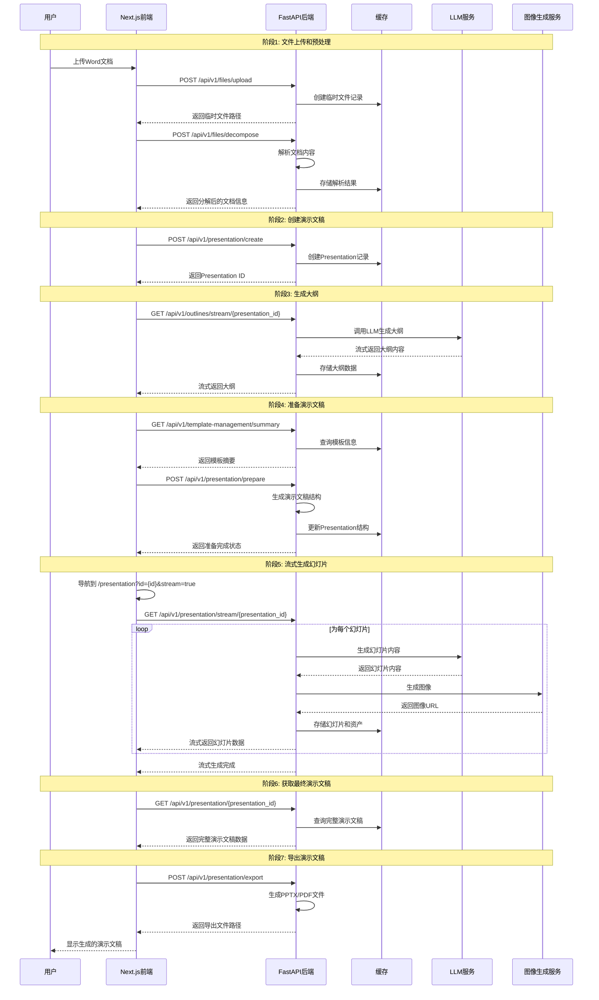

# PPT生成系统时序图

基于代码分析和日志记录，以下是PPT生成系统的完整时序图：

## 关键流程说明

### 1. 文件上传和预处理阶段
- **文件上传**: 用户上传Word文档，系统保存为临时文件
- **文档分解**: 解析文档内容，提取文本信息用于后续处理

### 2. 演示文稿框架创建
- 创建空的演示文稿记录，分配唯一ID

### 3. 大纲生成阶段
- 使用LLM服务根据文档内容生成演示文稿大纲
- 采用流式传输方式实时返回生成进度

### 4. 演示文稿准备阶段
- 查询可用模板信息
- 根据大纲和模板生成演示文稿结构

### 5. 流式幻灯片生成
- 核心生成阶段，为每个幻灯片:
  - 调用LLM生成具体内容
  - 调用图像生成服务创建配图
  - 存储幻灯片数据和资产
  - 流式返回给前端

### 6. 最终处理和导出
- 获取完整演示文稿数据
- 支持更新和编辑
- 导出为PPTX或PDF格式

## 技术特点

1. **异步流式处理**: 使用SSE(Server-Sent Events)实现实时进度更新
2. **模块化设计**: 各阶段职责清晰，便于扩展和维护
3. **并发处理**: 幻灯片生成和图像生成并行执行
4. **错误处理**: 完善的异常处理和重试机制
5. **模板系统**: 支持自定义模板和布局管理